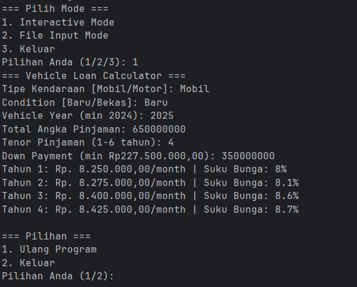

# Credit Service


## Features
- ✅ CLI and REST API modes
- ✅ Dynamic interest rate calculation
- ✅ Input validation (DP %, vehicle year, etc.)

## Quick Start
```bash
# Clone and run with Docker
git clone https://github.com/wanebane/credit-service.git
cd credit-service
docker-compose up --build
```

### How to run the application
```bash
mvn clean package
```
#### 1. CLI Mode
**Interactive or File Input**
```bash
java -jar target/credit-simulator.jar --cli
```
**Sample Output**


#### 2. API Mode
```bash
java -jar target/credit-simulator.jar
```
```bash
curl -X POST localhost:9093/credit-service/api/v1/loan/calculate \
  -H "Content-Type: application/json" \
  -d '{
    "vehicleType": "Mobil",
    "vehicleCondition": "Baru",
    "vehicleYear": 2025,
    "totalLoanAmount": 100000000,
    "loanTenure": 6,
    "downPayment": 50000000
  }'
```

**Sample Response :**
```json
{
    "message": "Success to calculate data",
    "data": [
        "Tahun 1: Rp. 1.027.777,78/month | Suku Bunga: 8%",
        "Tahun 2: Rp. 1.031.944,44/month | Suku Bunga: 8.1%",
        "Tahun 3: Rp. 1.052.777,78/month | Suku Bunga: 8.6%",
        "Tahun 4: Rp. 1.056.944,44/month | Suku Bunga: 8.7%",
        "Tahun 5: Rp. 1.077.777,78/month | Suku Bunga: 9.2%",
        "Tahun 6: Rp. 1.081.944,44/month | Suku Bunga: 9.3%"
    ]
}
```

#### File Input Format
Place files in `./input_samples` or using custom_path like `./custom/input/file_inputs.txt`.
Only allowed `.txt` extension files.

#### Key-value format
```text
vehicleType=Mobil
vehicleCondition=Baru
vehicleYear=2025
totalLoan=100000000
tenure=3
downPayment=35000000
```

#### JSON format
```text
{
  "vehicleType": "Mobil",
  "vehicleCondition": "Baru",
  "vehicleYear": 2025,
  "totalLoan": 100000000,
  "tenure": 3,
  "downPayment": 35000000
}
```

#### 2. Unit Test
```bash
# Run locally
mvn test
```


## Development
```bash
# Run locally without Docker
mvn spring-boot:run
```